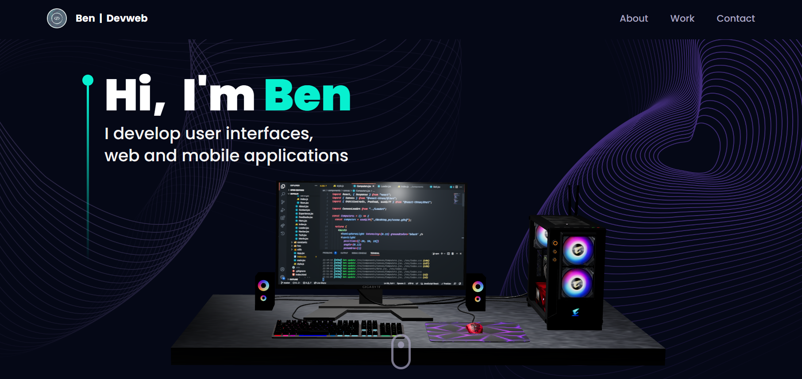
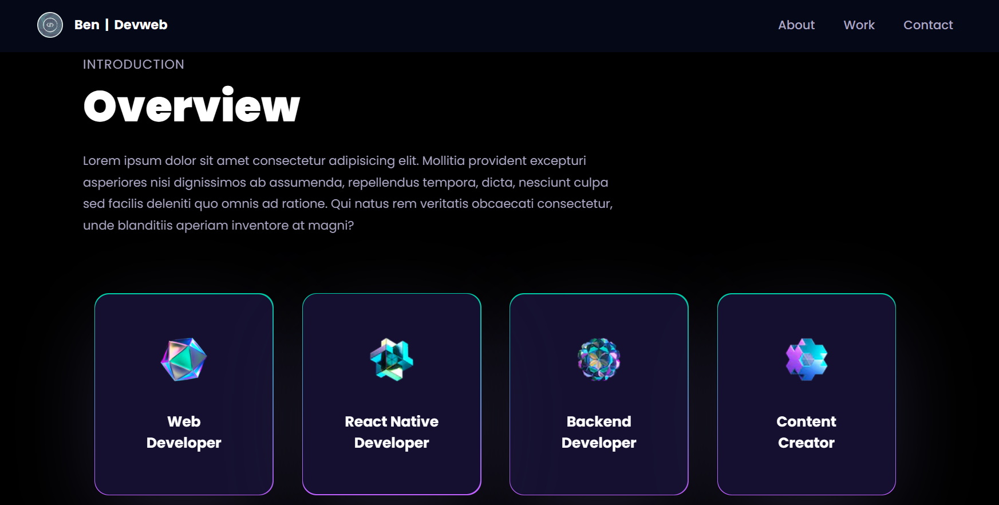

# **3D Portfolio**

This 3D portfolio presents my projects, from 3D modeling, animation and rendering. It was created to demonstrate my skills and experience as a 3D designer.

## **Technologies used**

---

- `threejs` : for modeling, animation, and rendering of my 3D projects.

- `React Tilt` : For manipulate my 3D models.

## **My projects**

---

This 3D portfolio showcases a selection of my most recent projects, which include:

3D models of everyday objects, such as furniture, home appliances, and electronic gadgets.
3D character design projects, from modeling to animation and rendering.
3D animation projects, which demonstrate my ability to bring static models to life.
Architectural visualization projects, which showcase interior and exterior design.

### **How to navigate**

This portfolio is divided into different sections, each dedicated to a specific type of project. You can navigate between the different sections using the navigation menu located at the top of the page.

### **Provisional rendering**

---

### **How to contact me**

If you have any questions about my projects or would like to discuss potential collaborations, feel free to contact me on <strong>Twitter</strong> at [bendevweb]("https://twitter.com/BenDevweb89")
